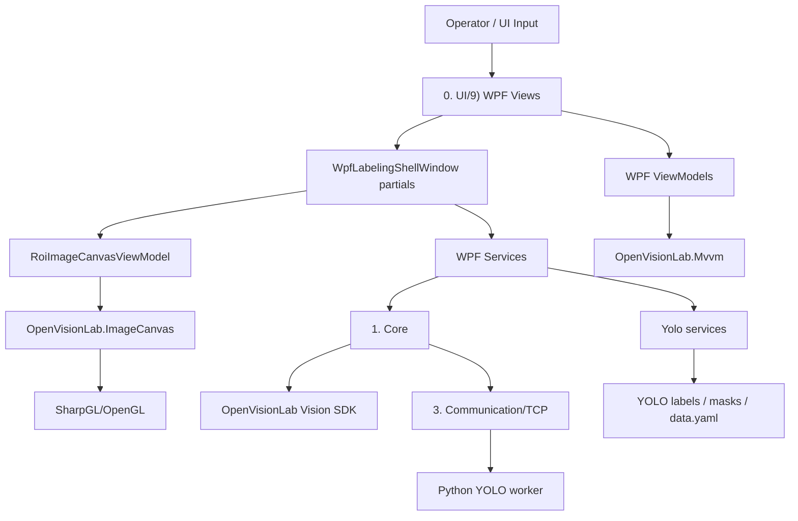

# Code Structure

이 문서는 `OpenVisionLab Labeling Studio` 코드베이스의 상위 수준 구조를 빠르게 파악하기 위한 안내서입니다. 세부 구현 이력은 `docs/WPF_VIEW_MIGRATION.md`, 작업 복구 맥락은 `docs/CODEX_RECOVERY.md`, 실행/빌드/테스트 명령은 `README.md`를 함께 봅니다.

## 목적

이 애플리케이션은 WPF 기반 라벨링 워크벤치입니다. 사용자는 이미지 큐에서 이미지를 고르고, OpenGL 캔버스 위에서 ROI/세그먼트 라벨을 만들고, YOLO 추론 후보를 검토하고, 학습용 데이터셋을 저장/점검합니다.

현재 구조 전환의 큰 방향은 다음과 같습니다.

- WPF가 메인 셸, 패널, 워크플로우, 명령 바인딩을 소유합니다.
- ViewModel은 화면 상태와 명령 상태를 소유합니다.
- Service는 라벨링 규칙, 데이터셋 저장, 검출 후보 상태, 이미지 로드, 마스크/ROI 연산처럼 테스트 가능한 비주얼 외 로직을 소유합니다.
- OpenVisionLab.ImageCanvas는 고성능 OpenGL 뷰어 경계입니다.
- Python/YOLO는 학습, 추론, weight/runtime을 소유하고 C#은 TCP 프로토콜과 데이터셋/라벨 상태를 관리합니다.

공개 제품명은 `OpenVisionLab Labeling Studio`, 빌드/실행 산출물명은 `OpenVisionLab.LabelingStudio`입니다. 내부 C# 네임스페이스에 남아 있는 `MvcVisionSystem`은 XAML partial class와 레거시 코드 연결 때문에 별도 마이그레이션 대상으로 남겨둔 기술 부채이며, 사용자-facing 제품명으로 쓰지 않습니다.

## 구조 리팩토링 상태

Status: Complete (2026-07-27)

사람과 LLM이 폴더, 클래스, 계약과 실행 책임을 빠르게 찾도록 만드는
구조 리팩토링 단계는 완료되었습니다. Core·Model·Yolo의 책임 소유권과
공개 계약 파일을 정리했고, 실제 레이아웃과 예외는 이 문서를 현재
navigation source로 사용합니다.

완료는 “앞으로 리팩토링을 하지 않는다”는 뜻이 아닙니다. 파일 길이나
타입 개수만으로 추가 분리하지 않고, 이후 기능 개발에서 다음 중 하나가
실제로 드러날 때만 구조 작업을 다시 엽니다.

- 서로 다른 도메인의 정책이나 상태가 한 소유자에 섞임
- 독립적으로 검증해야 할 책임에 테스트 경계가 없음
- 반복 사용되는 로직이 잘못된 계층이나 도메인에 있음
- 문서와 실제 파일 소유권이 달라 탐색 오류가 발생함

현재 다음 우선순위는 추가적인 기계적 구조 변경이 아니라 기능 개발과
재현된 결함 수정입니다.

## 빠른 읽기 순서

처음 구조를 파악할 때는 아래 순서로 읽습니다. 이 순서를 따르면 이미 검증된 성능 경로를 건드리지 않고도 변경 위치를 빠르게 찾을 수 있습니다.

1. `docs/LABELING_PROGRAM_DIRECTION.md`
   - 제품 목적, UI 방향, Python/C# 책임 경계를 확인합니다.
2. `docs/STABLE_VERIFIED_AREAS.md`
   - 이미 검증된 성능/UX 경로와 필수 회귀 테스트를 확인합니다.
3. `docs/OBJECT_DETECTION_MVP_COMPLETION.md`
   - 객체탐지 MVP 완료 기준, 포함/제외 범위, 필수 게이트를 확인합니다.
4. `docs/YOLOV5_TRAINING_RESULT_WORKFLOW.md`, `docs/SEGMENTATION_UX_COMPLETION.md`, `docs/ANOMALY_DETECTION_FLOW.md`
   - 학습/비교, 세그멘테이션, 이상탐지 작업이라면 각 영역의 완료 기준과 제외 범위를 먼저 확인합니다.
5. 이 문서의 `변경 위치 선택 가이드`
   - 실제 수정할 파일군을 고릅니다.
6. 관련 `WpfLabelingShellWindow.<Domain>.cs` partial
   - shell orchestration 흐름만 확인합니다.
7. 관련 ViewModel/Service/Presenter
   - 상태, 표시 문구, selection policy, 저장/검증 로직의 실제 소유자를 확인합니다.

문서나 PowerShell 출력에서 한글이 깨져 보이면 파일을 추측으로 다시 작성하지 말고 `Get-Content -Encoding utf8` 또는 `rg`로 먼저 확인합니다.

## 현재 제품 단계

| 영역 | 현재 판단 | 다음 판단 기준 |
| --- | --- | --- |
| 집중형 로컬 워크플로 | 최신 감사 `4.0/5`. Recipe 설정부터 라벨링·학습·추론·후보 검토·모델 근거까지 연결됨. | 기능 유무를 반복하지 말고 실제 작업자 근거와 독립 데이터 gate로 판단. |
| 객체탐지 라벨링 | MVP 완료 기준, ROI 성능, 저장, Candidate Review, Worklist, 실제 EXE 라벨링이 검증됨. | 독립 생산 카메라/session의 신뢰 가능한 box 데이터가 있을 때만 품질 비교. |
| Viewer 성능 | 핵심 병목은 안정화됨. 50만 ROI, 브러시/지우개, 삭제 후 줌, texture pan 경로가 보호 대상. | `STABLE_VERIFIED_AREAS.md`의 focused gate 없이 변경하지 않음. |
| MVVM 구조 | Core·Model·Yolo 계약 소유권과 navigation 정리 단계가 완료됨. | 파일 길이가 아니라 실제 혼합 소유권, 재사용 또는 테스트 경계 문제가 재현될 때만 구조 작업 재개. |
| 초보자 UX | Dataset wizard, task 탭, Guide, Candidate Review, Worklist와 실제 EXE 3-purpose 흐름이 검증됨. | 상용 영상 근거에 따라 Dataset Health의 읽기 전용 시각적 라벨 QA를 다음 bounded slice로 구현. |
| 세그멘테이션 | polygon/brush/eraser 저장·재열기·후보 검토·학습 경로와 MobileSAM box 보조가 검증됨. | point prompt나 merge/split은 실제 작업자 실패와 저장/export 계약이 있을 때만. |
| 이상탐지 | image-level Normal/Abnormal 목적, intake, 학습/평가, 모델 비교와 hold guard가 연결됨. | 균형 잡힌 독립 생산 카메라/cross-session 데이터가 있을 때만 품질 판단. |

## 최상위 폴더

| 경로 | 역할 |
| --- | --- |
| `Program.cs` | 앱 시작점. 기본적으로 WPF 라벨링 셸을 실행합니다. |
| `OpenVisionLab.LabelingStudio.csproj` | .NET 8 Windows 데스크톱 앱 프로젝트. WPF가 기본이며 일부 OpenGL 호환 경계 때문에 WinForms도 켜져 있습니다. |
| `0. UI/9) WPF` | 현재 메인 WPF UI, ViewModel, UI 전용 service, shell partial 파일. |
| `1. Core` | application state와 핵심 workflow service. 책임별 하위 폴더는 아래 `Core 책임 구조`를 따릅니다. |
| `2. Common` | 공용 유틸리티, 로그/메시지 어댑터 등 앱 공통 기능. |
| `3. Communication/TCP` | Python YOLO worker와 통신하는 TCP listener, 메시지 framing, protocol parsing. |
| `Yolo` | YOLO 클래스/라벨 저장, dataset yaml, split, readiness/validation/statistics, review status. |
| `Library` | 레거시/호환 viewer 계층. `CViewer`는 OpenVisionLab ImageCanvas 기반으로 축소 유지됩니다. |
| `OpenVisionLab/Library` | 내부 복사본 라이브러리. 특히 `OpenVisionLab.ImageCanvas`가 ROI/OpenGL 캔버스 핵심입니다. |
| `dll` | 깨끗한 체크아웃에 필요한 재배포 의존성. 비전 알고리즘과 기하는 정확히 고정된 `OpenVisionLab.Core.dll` 및 `OpenVisionLab.Vision2D.dll` SDK 페이로드가 소유하고, UI 어댑터와 정렬된 OpenCvSharp 런타임은 앱이 소유합니다. |
| `tests/LabelingApplication.Tests` | 단위/통합/smoke 회귀 테스트. UI 없이 검증하는 구조 검사가 많습니다. |
| `docs` | `docs/README.md`에서 현재 권위·운영 가이드·기능 계약·검증 증거·역사 기록으로 분류하는 개발·검증 문서. |
| `scripts` | 빌드/게시/첫 실행/YOLO smoke 자동화 스크립트. |
| `config` | runtime path 예제 설정. 개인 설정은 local json으로 분리합니다. |
| `artifacts` | Git에서 제외되는 빌드·테스트·UI·릴리스·검증 산출물. 삭제 전에 `REPOSITORY_ARTIFACT_INVENTORY_AND_RETENTION_POLICY_20260731.md`의 보존 분류와 승인 gate를 따릅니다. |

## 저장소 루트 배치 원칙

저장소 루트에는 Git·빌드·실행·법적 고지·공개 진입점에 직접 필요한 파일만 둡니다.

- Git: `.gitattributes`, `.gitignore`
- 빌드 진입점: 솔루션, 프로젝트, `Program.cs`, `Directory.Build.props`, `global.json`
- 실행 설정과 자산: `log4net.config`, `lens.ico`
- 공개·운영 계약: `README.md`, `AGENTS.md`, `LICENSE`, `NOTICE`, `THIRD-PARTY-NOTICES.txt`, `RELEASE_NOTES.md`
- 내부 인수인계와 복구 기록: `docs/CODEX_NEXT_PROMPT.md`, `docs/CODEX_RECOVERY.md`

새 루트 파일을 추가하기 전에는 다음을 확인합니다: Git·빌드·실행·법적 고지·공개
진입점이 그 파일을 루트에서 직접 요구하는가? 아니라면 기존 `docs`, `scripts`,
`config` 또는 해당 기능 소유 폴더에 둡니다.

생성물 구조를 검토할 때는
`scripts/Get-RepositoryArtifactInventory.ps1`을 사용합니다. 이 스크립트는
인벤토리와 보존 검토 분류만 만들며 파일을 삭제하거나 이동하지 않습니다.
테스트 최종 빌드 출력은
`scripts/Build-LabelingApplicationTests.ps1`을 통해
`artifacts/tests/<목적>` 아래에 생성합니다.

문서 파일은 물리적으로 이동하지 않아도 `docs/README.md`에서 정확히 한 번
분류되어야 합니다. `scripts/Test-DocumentationInformationArchitecture.ps1`은
분류 누락·중복과 탐색 허브의 깨진 로컬 링크를 읽기 전용으로 검사합니다.

`scripts/Get-RepositoryCleanupPreview.ps1`은 최신 읽기 전용 인벤토리에서
`rebuildable-candidate`만 추출하고 논리 경로를 실제 C/D 물리 경로로
해석합니다. 이 도구는 정리 대상을 삭제하거나 이동하지 않으며, 출력 JSON도
`deletionPerformed=false`, `operationsAuthorized=false`로 고정합니다.

`scripts/Invoke-ApprovedRepositoryCleanup.ps1`은 별도 사용자 승인을 받은
C 드라이브 후보만 실행하는 제한된 소유자입니다. 미리보기의 개수와 바이트,
저장소 내부 실제 경로, 비접합/비재분석 지점, 비중첩, 실행 직전 파일 합계를
모두 검증하고 각 대상 처리 후 증적을 갱신합니다. D 드라이브와 보호 분류는
이 실행 경계에 포함되지 않습니다.

## 의존 방향

일반적인 의존 방향은 아래처럼 유지합니다.



재사용 가능한 매칭, OpenCV 도구 속성/결과, 측정 기하는 OpenVisionLab
Vision SDK가 소유합니다. 앱에는 UI 변환과 워크플로 조정만 남깁니다. 정확한
소비 및 업그레이드 계약은
`docs/OPENVISIONLAB_VISION_SDK_MIGRATION_20260805.md`에 기록합니다.

핵심 원칙은 View가 로직을 직접 소유하지 않는 것입니다. 단, `WpfLabelingShellWindow`는 아직 composition root이자 전환 중인 shell orchestration 지점이므로, partial 파일로 책임을 나누고 service/ViewModel로 계속 빼는 방향입니다.

## WPF UI 구조

`0. UI/9) WPF`는 다음 하위 구조를 갖습니다.

| 경로 | 역할 |
| --- | --- |
| `Views` | XAML/UserControl/Window. 화면 요소와 shell partial orchestration. |
| `ViewModels` | WPF 패널 상태, command state, 표시 텍스트, selected item, enabled state. `Shell`, `Labeling`, `Dataset`, `Model`의 네 소유 도메인으로 구성. |
| `Services` | WPF 경계에서 필요한 테스트 가능 로직. presenter, selection, image load, annotation workflow, mask/ROI state 등. |
| `Models` | WPF 전용 표시 모델. 예: image queue row/filter model. |
| `Interop` | 기존 진입점에서 WPF shell을 여는 얇은 bridge. |

### WpfLabelingShellWindow

`WpfLabelingShellWindow.xaml.cs`는 shell의 composition root입니다. 직접 모든 기능을 구현하지 않고, 아래와 같이 partial 파일로 책임을 나눕니다.

| partial 패턴 | 책임 |
| --- | --- |
| `PanelWiring.*` | UserControl DataContext 구성, 이벤트/command wiring. |
| `PanelAccessors` | 패널 ViewModel 접근자. |
| `Shell*` | shell lifecycle, input command, status/log, project setting. |
| `Workflow*` | workflow mode, command state fanout, training guide command. |
| `ImageQueue*` | 이미지 큐 로딩/선택/상태/명령. |
| `Annotation*` | ROI, polygon, brush/eraser, undo/redo, save. |
| `AnnotationMask*` | raster mask brush/eraser preview, commit queue, overlay update. |
| `ObjectReview*` | 현재 수동 ROI/segment/object review. |
| `CandidateReview*` | AI 후보 목록, 비교, 확정/스킵/navigation, PatchCore 히트맵 검토 창 수명. |
| `Detection*` | 단일/배치 검출 실행, 결과 적용, smoke 실행. |
| `Yolo*` | Python worker runtime/status/settings/training command. |
| `ProjectConfig*` | recipe/config path, persistence, command. |
| `Training*` | 학습 readiness, progress, history. |

새 기능을 넣을 때는 먼저 이미 같은 도메인 partial이 있는지 확인합니다. 새 도메인이라면 `WpfLabelingShellWindow.<Domain>.cs`를 추가하되, 계산/상태 변환은 가능하면 `Services` 또는 `ViewModels`로 둡니다.

## ViewModel 정책

ViewModel은 가능하면 이름에 `ViewModel`을 명시합니다. UserControl이 자기 ViewModel을 직접 생성하지 않고, shell composition root가 DataContext를 주입합니다. View를 단독 이동/생성해도 ViewModel 생성 실패로 깨지지 않는 방향입니다.

대표 ViewModel:

| 경로 | 대표 파일 | 역할 |
| --- | --- | --- |
| `ViewModels/Shell` | `WpfLabelingShellViewModel`, `WpfLearningWorkflowPanelViewModel`, `WpfLearningWorkflowItems`, `WpfRuntimeDiagnosticsViewModel`, `WpfEnvironmentSetupCenterViewModel` | shell composition, workflow navigation, 공통 status/log 상태, workflow 표시 item, 명시적 환경 점검/support export 상태, 앱/뷰어/선택 모델 실행기의 읽기 전용 통합 설치 안내. |
| `ViewModels/Labeling` | `WpfCanvasPanelViewModel`, `WpfImageQueuePanelViewModel`, review ViewModel | 라벨 편집, 이미지 큐, 후보/객체 검토 상태. |
| `ViewModels/Dataset` | `WpfDatasetSetupWizardViewModel`, `WpfProjectConfigPanelViewModel` | 데이터셋 선택·건강 상태와 Recipe/config 상태. |
| `ViewModels/Model` | `WpfTrainingSettingsPanelViewModel`, `WpfYoloModelSettingsPanelViewModel`, `WpfModelBenchmarkViewModel`, `WpfModelBenchmarkItems` | 학습, 실행기 설정, 모델 비교 상태와 benchmark row/item 표시 모델. |

MVVM 공용 기반은 `OpenVisionLab/Library/OpenVisionLab.Mvvm`입니다. WPF ViewModel은 `WpfObservableViewModel`을 통해 shared observable/command infrastructure를 사용합니다.

StatusBar, ProjectConfig, YOLO 설정/명령 상태는 shell이 해당 ViewModel만 갱신하고 XAML binding이 control에 전달합니다. 이 경로에 `TextBlock.Text`나 `ProgressBar.Visibility` 직접 쓰기 fallback을 다시 추가하지 않습니다. focus, theme, animation처럼 실제 control 수명주기가 필요한 작업만 View adapter에 남깁니다.

## WPF Services

WPF service는 UI shell에서 뽑아낸 테스트 가능한 정책/계산/상태 변환입니다. 물리 경로도 `Services` 바로 아래에 평면으로 두지 않고, 아래 도메인 하위 폴더와 일치시킵니다. namespace는 이동만으로 바꾸지 않습니다.

| 경로 | 대표 파일 | 역할 |
| --- | --- | --- |
| `Services/Annotation` | `WpfAnnotationProductivityService`, `WpfAnnotationProductivityContracts`, `WpfSmartMaskPromptSessionService`, `WpfFourPointBoxService`, `WpfAnnotationHistoryService`, `WpfMask*`, `WpfPolygonAnnotationService`, `WpfIntelligentScissorsService` | annotation 단축키/반복/안전한 복제 정책, Smart Mask prompt/generation session, four-point extreme-box draft/geometry, mask 편집 상태와 undo/redo, polygon 유효성/정점 변경, bounded image-edge path 계산. |
| `Services/Anomaly` | `WpfAnomaly*` | anomaly 평가와 dashboard 표시. |
| `Services/CandidateReview` | `WpfCandidateReview*`, `WpfCandidateConfirmationService`, `WpfPatchCoreHeatmapReviewService` | AI 후보 row/detail, review state, confirm/skip 정책, PatchCore heatmap 경로 검증과 no-lock decode. |
| `Services/Dataset` | `WpfDataset*`, `WpfRecipeDatasetVersionPresentationService` | dataset setup, 상태, 품질, version 표시. |
| `Services/Detection` | `WpfDetection*`, `WpfBatchDetectionProgressService`, `WpfInferenceStatusPresentationService` | 검출 target, result card, batch progress, worker wait. |
| `Services/ImageQueue` | `WpfImageQueue*`, `WpfImageDecode*`, `WpfImageLoad*` | 큐 선택/표시와 이미지 decode/cache/preload. |
| `Services/Model` | `WpfModel*`, `WpfMobileSamBoxPromptService`, `WpfSegmentationAdapterComparisonRunService` | model catalog, 비교, runtime 안내. |
| `Services/ObjectReview` | `WpfObjectReview*` | object row text, class/delete plan, selection policy. |
| `Services/Project` | `WpfProjectRecipe*` | recipe path와 session 상태. |
| `Services/Training` | `WpfTraining*`, `WpfWorkflow*` | training readiness/progress와 workflow command state. |
| `Services/Runtime` | `WpfYolo*`, `WpfRuntimeDiagnosticsService`, `WpfHeadlessRuntimeCommandService`, `WpfOpenGlRuntimeCapabilityProbe` | YOLO runtime/settings 상태, current-user 진단 경로, 읽기 전용 환경 self-test CLI, 시작 기록, 보존, 실제 Main Viewer 그래픽 환경 점검, allow-list support export. |

`WpfEnvironmentSetupCenterWindow`는 독립된 다크 전용 환경 안내 창이며,
`WpfLabelingShellWindow.EnvironmentSetupCenter.cs`는 창 수명주기와 기존 모델 센터
이동만 연결합니다. 상태 판정은 `WpfEnvironmentSetupCenterViewModel`, 기존
`WpfRuntimeDiagnosticsService`, `PythonModelRuntimeSelfTestService`가 소유합니다.
창 열기/새로고침은 읽기 전용이며 설치·설정 저장·학습·추론을 실행하지 않습니다.
| `Services/Infrastructure` | `WpfFileDialogService`, `WpfWorkspaceLayoutSettingsService`, `WpfApplicationClosePolicyService` | WPF 공통 dialog, workspace layout 설정, 안전 종료 상태/결정 정책. |

새 UI 요구사항이 생기면 먼저 Presenter/Selection/State service로 분리할 수 있는지 봅니다. Shell partial에는 “어느 service를 언제 호출할지” 정도만 남기는 것이 목표입니다.

## OpenGL Viewer 경계

고성능 viewer 경계는 `OpenVisionLab/Library/OpenVisionLab.ImageCanvas`입니다.

| 경로 | 역할 |
| --- | --- |
| `Engine/ImageCanvasControl.cs` | SharpGL 기반 OpenGL control. texture, refresh, pan/zoom, overlay drawing의 핵심. |
| `Engine/ImageCanvasControl.ViewState.cs` | zoom/fit/actual size/view state 적용. |
| `ViewModel/RoiImageCanvasViewModel.cs` | WPF shell과 ImageCanvas 사이의 ViewModel bridge. ROI/mask/detection overlay 입력 경로. |
| `ViewModel/RoiImageCanvasViewModel.Refresh.cs` | refresh/debounce/render 요청 경로. |
| `RoiInteraction` | ROI mouse down/move/up/key/cursor 조작 로직. |
| `OpenGL` | OpenGL shape/texture/text drawing helper. |
| `Overlays` | ROI/detection/polygon/mask overlay index/manager. |
| `Canvas`, `Model`, `Compatibility` | canvas DTO, shape model, 호환 API. |

성능상 중요한 규칙:

- MouseMove에서 전체 overlay list를 매번 스캔하지 않습니다.
- ROI hit-test/render는 spatial index와 visible viewport query를 사용합니다.
- Pan/zoom/ROI drag/drawing preview는 가능한 한 cached scene과 live overlay path를 사용합니다.
- Brush/eraser drag는 OpenGL FBO preview를 사용하고, CPU MaskData/history commit은 MouseUp 이후 queue로 처리합니다.
- 단일 ROI 삭제/수정은 해당 overlay만 update/remove하고, 전체 redraw/rebuild를 피합니다.
- 대량 객체 50만 개 테스트는 viewer 구조 회귀를 잡는 기준입니다.

## 라벨링 데이터와 YOLO 계층

`Yolo` 폴더는 라벨 파일과 학습 dataset 상태를 담당합니다.

| 파일 | 역할 |
| --- | --- |
| `ClassCatalogService.cs` | 클래스 추가/삭제/정규화. |
| `YoloAnnotationService.cs` | box 라벨 저장/로드, YOLO txt line 변환. |
| `YoloSegmentationAnnotationService.cs` | polygon/mask 저장·로드와 versioned annotation schema의 의도적 동거. |
| `YoloDatasetSplitService.cs` | train/valid/test deterministic split. |
| `YoloDatasetValidationContracts.cs` | dataset validation 오류와 split/class/annotation 통계 계약. |
| `YoloDatasetValidator.cs` | dataset config/files/statistics 검증. |
| `YoloDatasetReadinessContracts.cs` | 학습 readiness 결과와 목적별 요약 계약. |
| `YoloDatasetReadinessService.cs` | 검증·통계를 조합해 학습 readiness report 구성. |
| `YoloDatasetHealthContracts.cs` | 목적별 Dataset Health 상태·보고서·split/class 요약 계약. |
| `YoloDatasetHealthService.cs` | readiness·품질 감사를 조합해 Dataset Health 결과 구성. |
| `YoloDatasetQualityAuditContracts.cs` | detection dataset 품질 report와 split summary 계약. |
| `YoloDatasetQualityAuditService.cs` | image/label artifact를 검사해 품질 통계와 class 분포 집계. |
| `YoloDatasetQualityAuditExportContracts.cs` | 품질 감사 Markdown export 결과 계약. |
| `YoloDatasetQualityAuditExportService.cs` | audit report를 Markdown으로 구성·저장. |
| `AnomalyClassificationDatasetExportContracts.cs` | anomaly normal/abnormal classification dataset export 결과 계약. |
| `AnomalyClassificationDatasetExportService.cs` | 검토 상태를 Ultralytics classification 폴더 dataset으로 export. |
| `AnomalyClassificationEvaluationContracts.cs` | anomaly held-out sample·threshold options·adoption report 계약. |
| `AnomalyClassificationEvaluationService.cs` | summary JSON 해석과 fail-closed accuracy/adoption 판정. |
| `1. Core/Anomaly/PatchCoreAnomalyTrainingReadinessService.cs` | normal-only PatchCore 학습의 Recipe 목적, 검토 상태, train/val split 준비 계약. |
| `ModelAdapterCatalogContracts.cs` | Model Center adapter task/data/runtime/evidence 항목 계약. |
| `ModelAdapterCatalogService.cs` | 구현 capability에서 read-only adapter catalog 구성. |
| `Runtime/Python/openvisionlab_patchcore_worker.py` | PatchCore 특징 추출, bounded coreset, 정상 임계값 보정, TCP 학습/검사, 위치 후보와 heatmap 생성. |
| `YoloExternalEvaluationDataAuditContracts.cs` | 외부 평가 폴더와 active dataset의 content 중복 audit 결과 계약. |
| `YoloExternalEvaluationDataAuditService.cs` | 지원 이미지 탐색과 SHA-256 name/content overlap 계산. |
| `YoloDatasetDiagnosticsService.cs` | operator-facing 문제/경고 report. |
| `YoloImageReviewStatusContracts.cs` | detection/quality review enum과 이미지별 status 계약. |
| `YoloImageReviewStatusService.cs` | 이미지별 후보/확정/실패/스킵/검출없음 상태 저장. |
| `YoloImageLabelStatusContracts.cs` | 이미지별 label path·object/invalid count·표시 상태 계약. |
| `YoloImageLabelStatusService.cs` | detection/segmentation artifact에서 이미지 label status 계산. |
| `YoloImageQualityReviewReportExportContracts.cs` | 품질 검토 Markdown export 결과 계약. |
| `YoloImageQualityReviewReportExportService.cs` | 이미지 quality 상태를 집계해 Markdown 구성·저장. |
| `YoloExternalDatasetIntakeContracts.cs` | 외부 native YOLO 검증·source packet·runtime materialization 결과 계약. |
| `YoloExternalDatasetIntakeService.cs` | 외부 data.yaml 검증, source identity, app-owned runtime copy 정책. |
| `CocoDetectionExportContracts.cs` | COCO detection export 결과와 JSON document DTO 계약. |
| `CocoDetectionExportService.cs` | YOLO box dataset을 COCO detection JSON으로 변환·저장. |
| `CocoSegmentationExportContracts.cs` | COCO segmentation export 결과와 JSON document DTO 계약. |
| `CocoSegmentationExportService.cs` | polygon artifact를 COCO segmentation JSON으로 변환·저장. |
| `CocoImportContracts.cs` | COCO detection/segmentation import 결과 계약. |
| `CocoDetectionImportService.cs` | COCO box annotation을 local image/YOLO label로 import. |
| `CocoSegmentationImportService.cs` | COCO polygon을 local segment/mask artifact로 import. |
| `LabelStudioDetectionExportContracts.cs` | Label Studio detection task/result/value DTO 계약. |
| `LabelStudioDetectionExportService.cs` | YOLO box dataset을 Label Studio task JSON으로 변환·저장. |
| `LabelStudioSegmentationExportContracts.cs` | Label Studio segmentation task/result/value DTO 계약. |
| `LabelStudioSegmentationExportService.cs` | polygon artifact를 Label Studio task JSON으로 변환·저장. |
| `LabelStudioImportContracts.cs` | Label Studio detection/segmentation import 결과 계약. |
| `LabelStudioDetectionImportService.cs` | rectangle task를 local image/YOLO label로 import. |
| `LabelStudioSegmentationImportService.cs` | polygon task를 local segment/mask artifact로 import. |
| `PascalVocDetectionInterchangeContracts.cs` | Pascal VOC detection export/import 결과 계약. |
| `PascalVocDetectionExportService.cs` | YOLO box dataset을 Pascal VOC XML로 export. |
| `PascalVocDetectionImportService.cs` | Pascal VOC XML/image를 local YOLO dataset으로 import. |
| `CvatArchiveExportContracts.cs` | CVAT detection/segmentation archive export 결과 계약. |
| `CvatImageTaskArchiveExportService.cs` | YOLO box dataset을 CVAT image-task archive로 export. |
| `CvatSegmentationArchiveExportService.cs` | polygon artifact를 CVAT image-task archive로 export. |
| `CvatImportContracts.cs` | CVAT detection/segmentation import 결과 계약. |
| `CvatDetectionImportService.cs` | CVAT box archive를 local image/YOLO label로 import. |
| `CvatSegmentationImportService.cs` | CVAT polygon archive를 local segment/mask artifact로 import. |
| `DatasetExportCapabilityContracts.cs` | 외부 형식별 방향·목적·구현·추천·검증 항목 계약. |
| `DatasetExportCapabilityService.cs` | 구현된 상호변환 목록과 다음 추천 대상 정책 구성. |
| `YoloSegmentationTrainingLabelContracts.cs` | segmentation training label export count·error·readiness 결과 계약. |
| `YoloSegmentationTrainingLabelService.cs` | segment/mask artifact를 Ultralytics polygon label로 변환. |
| `UnetSegmentationDatasetExportContracts.cs` | canonical U-Net export 결과, class contract, dataset manifest DTO. |
| `UnetSegmentationDatasetExportService.cs` | recipe segmentation을 app-owned image/mask artifact로 export. |
| `SegmentationPredictionExportContracts.cs` | U-Net/Ultralytics raster prediction export 요청·결과 계약. |
| `SegmentationPredictionExportService.cs` | adapter별 Python 요청 검증·process 구성·실행. |
| `SegmentationMaskComparisonContracts.cs` | mask 비교 요청·결과·run/class metric·prediction manifest 계약. |
| `SegmentationMaskComparisonService.cs` | 호환되는 prediction manifest와 canonical mask의 Dice/IoU/component 비교. |
| `YoloSegmentationHistoricalRemediationAuditContracts.cs` | legacy SEG dry-run report·image·record·export 결과 계약. |
| `YoloSegmentationHistoricalRemediationAuditService.cs` | legacy mask 호환성을 읽어 변경 없는 remediation 감사 report 구성·저장. |
| `YoloSegmentationTemplateContourMigrationContracts.cs` | 승인된 contour migration plan·item·result 계약. |
| `YoloSegmentationTemplateContourMigrationService.cs` | migration 계획 구성, staging·backup·검증·적용/복구 정책. |
| `CYolov5.cs` | legacy YOLOv5 YAML/training 호환 타입과 path helper의 의도적 동거. |

segmentation training label의 image/label/polygon/background count와 오류 및
readiness 결과는 `YoloSegmentationTrainingLabelContracts.cs`에서 찾습니다.
split별 artifact 탐색, OK background 복사, polygon 정규화와 label 파일
생성은 `YoloSegmentationTrainingLabelService.cs`가 소유합니다.

### Yolo 다중 공개 타입 의도적 동거 예외

2026-07-27 구조 감사 기준으로 `*Contracts.cs`가 아닌 Yolo 파일 중 공개
타입이 둘 이상인 파일은 다음 두 개뿐입니다.

- `CYolov5.cs`: 109줄의 legacy YOLOv5 adapter 호환 단위입니다.
  `YamlData`, training parameter, `Cfg`/`Weight`와 `CYolov5` YAML helper가
  같은 adapter 설정과 직렬화 규칙을 소유합니다. 다른 adapter가 이 계약을
  재사용하거나 compatibility alias가 제거되기 전에는 파일 수만 늘리는
  분리를 하지 않습니다.
- `YoloSegmentationAnnotationService.cs`: versioned annotation file,
  polygon/point record와 저장·로드/materialization이 하나의 persisted
  schema를 소유합니다. 독립 serializer/schema package가 생기거나 서비스
  없이 schema를 버전 관리해야 할 때만 별도 계약 파일을 검토합니다.

두 파일 모두 줄 수나 공개 타입 개수만으로 분리하지 않습니다. 특히
segmentation annotation 파일은 저장·mask materialization 성능 경로이므로
구체적인 결함이나 독립 소유권 없이 구조만 변경하지 않습니다.

segmentation adapter 비교는 두 독립 실행 경계를 파일명과 일치시킵니다.
prediction export request/result는
`SegmentationPredictionExportContracts.cs`에서 찾고,
`SegmentationPredictionExportService.cs`는 Python exporter process 검증과
실행을 소유합니다. mask 비교 request/result와
manifest/run/class metric은 `SegmentationMaskComparisonContracts.cs`에서
찾고, 호환성 검증·채점·report 저장은
`SegmentationMaskComparisonService.cs`가 소유합니다. 두 실행 서비스는 공개
namespace를 공유하지만 private 상태나 실행 정책은 공유하지 않습니다.

legacy SEG remediation dry-run의 report/image/record/export result는
`YoloSegmentationHistoricalRemediationAuditContracts.cs`에서 찾습니다.
legacy mask 판독, contour 제안, YOLO label diff와 Markdown 저장은
`YoloSegmentationHistoricalRemediationAuditService.cs`가 소유합니다.
승인된 실제 변경 단계의 plan/item/result는
`YoloSegmentationTemplateContourMigrationContracts.cs`에서 찾고, 계획 생성,
source hash 재검증, staging, backup, 적용 검증과 rollback은
`YoloSegmentationTemplateContourMigrationService.cs`가 소유합니다.

COCO와 Label Studio의 detection/segmentation export 결과 및 직렬화 DTO는
각 포맷의 `*ExportContracts.cs`에서 찾습니다. dataset artifact 탐색, 좌표
변환, invalid record 제외, 상대 경로 구성과 JSON 저장은 대응하는
`*ExportService.cs`가 소유합니다. 서비스 API와 JSON property 이름은
계약 파일 분리 전과 동일합니다.

COCO와 Label Studio import 결과는 각각 `CocoImportContracts.cs`와
`LabelStudioImportContracts.cs`에서 찾습니다. Pascal VOC detection의
export/import 결과는 `PascalVocDetectionInterchangeContracts.cs`가 함께
소유합니다. source 검증, 이미지 복사, class catalog 확장, 좌표 변환과 local
artifact 저장은 대응하는 서비스가 소유합니다.

CVAT detection/segmentation archive export 결과는
`CvatArchiveExportContracts.cs`, detection/segmentation import 결과는
`CvatImportContracts.cs`에서 찾습니다. XML/ZIP 구성과 해석, image copy,
class catalog 확장, 좌표 변환, local artifact 저장은 대응하는 CVAT
서비스가 소유합니다.

외부 형식 capability 항목의 shape는
`DatasetExportCapabilityContracts.cs`에서 찾습니다. 구현 여부, 검증
스위치, 현재 단일 추천 대상과 목록 순서는
`DatasetExportCapabilityService.cs`가 소유합니다.

외부 native YOLO intake의 report, split summary, read-only source entry/packet,
runtime dataset result는 `YoloExternalDatasetIntakeContracts.cs`에서 찾습니다.
YAML 해석, class/label 검증, source fingerprint, 명시적 reactivation,
app-owned runtime materialization은 `YoloExternalDatasetIntakeService.cs`가
계속 소유합니다. private scan/package 타입은 서비스 구현 세부사항으로
이동하지 않습니다.

U-Net canonical export 결과와 split summary, class contract, dataset
manifest/split/image DTO는 `UnetSegmentationDatasetExportContracts.cs`에서
찾습니다. recipe data tree 검증, polygon/mask rasterization, source tree hash,
artifact 재사용과 materialization은
`UnetSegmentationDatasetExportService.cs`가 소유합니다. 이 계약은 내부
recipe export, 외부 YOLO canonical export, prediction comparison이 함께
소비합니다.

dataset validation 오류와 통계는 `YoloDatasetValidationContracts.cs`에서
찾습니다. configuration, data.yaml, split separation, label/segment content
검증과 통계 누적 정책은 `YoloDatasetValidator.cs`가 소유합니다. 이 계약은
manifest, readiness, diagnostics, Dataset Health와 WPF presentation이 함께
소비합니다.

Dataset Health의 quality 상태, 종합 report, split/class summary는
`YoloDatasetHealthContracts.cs`에서 찾습니다. 목적별 readiness와 품질 감사
결과를 조합하고 issue를 정규화하는 정책은 `YoloDatasetHealthService.cs`가
소유합니다. 이 계약은 Dataset Health WPF ViewModel과 관련 테스트가
공유합니다.

detection dataset 품질 report와 split summary는
`YoloDatasetQualityAuditContracts.cs`에서 찾습니다. image/label artifact
탐색, missing/empty/invalid 판정과 class 분포 집계는
`YoloDatasetQualityAuditService.cs`가 소유합니다. Markdown export 결과는
`YoloDatasetQualityAuditExportContracts.cs`, 문서 구성과 저장은 대응하는
export 서비스가 소유합니다.

anomaly classification dataset의 output root와 normal/abnormal/skipped count는
`AnomalyClassificationDatasetExportContracts.cs`에서 찾습니다. 검토 상태
조회, split 선택, 폴더 초기화, 이미지 복사와 중복 파일명 처리는
`AnomalyClassificationDatasetExportService.cs`가 소유합니다.

anomaly held-out evaluation의 sample, threshold options와 report는
`AnomalyClassificationEvaluationContracts.cs`에서 찾습니다. summary JSON
해석, confidence를 포함한 correct count, overall/per-class accuracy와
fail-closed adoption 판정은 `AnomalyClassificationEvaluationService.cs`가
소유합니다.

Model Center의 adapter 항목은 `ModelAdapterCatalogContracts.cs`에서 찾고,
실제 구현 export capability를 읽어 task/data/runtime/evidence/next action
문구를 구성하는 정책은 `ModelAdapterCatalogService.cs`가 소유합니다. 외부
평가 데이터 audit report는 `YoloExternalEvaluationDataAuditContracts.cs`,
지원 이미지 탐색과 SHA-256 overlap 계산은 대응 서비스가 소유합니다.

detection review 상태, quality review 상태와 이미지별 status DTO는
`YoloImageReviewStatusContracts.cs`에서 찾습니다. 이미지 catalog 동기화,
JSON 저장/복원, label 상태 반영, 후보·확정·스킵·품질 검수 전환과 다음
미검토 이미지 선택은 `YoloImageReviewStatusService.cs`가 소유합니다. 이
계약은 WPF queue/presenter, 품질 보고서와 학습 workflow가 함께 소비합니다.

이미지별 label path/count/표시 상태는 `YoloImageLabelStatusContracts.cs`에서
찾고, detection label 또는 segmentation artifact 탐색과 count 계산은
`YoloImageLabelStatusService.cs`가 소유합니다. 품질 검토 Markdown export
결과는 `YoloImageQualityReviewReportExportContracts.cs`, 상태 집계와 문서
저장은 대응 서비스가 소유합니다.

`1. Core`의 `Labeling/LabelingWorkflowService`, `Detection/DetectionResultApplicationService`, `Dataset/LabelingDatasetManifestService`, `ApplicationState/CData`, `ApplicationState/LabelingProjectSettings`는 UI와 YOLO/file system 사이의 application state를 묶습니다.

## Core 책임 구조

`1. Core`는 namespace를 바꾸지 않고 물리 경로만 책임별로 나눕니다. 폴더는 탐색 경계이며, 새 계층이나 추상화를 뜻하지 않습니다.

| 경로 | 책임 | 대표 파일 |
| --- | --- | --- |
| `ApplicationState` | 전역 application state, recipe/system 상태, 영속 프로젝트 설정과 설정 모델 | `CData.cs`, `CGlobal.cs`, `LabelingProjectSettings.cs`, `PythonModelSettings.cs`, `ModelRegistrySettings.cs` |
| `Anomaly` | anomaly 검토 계약, 상태 저장/import/summary, 분류 결정, 학습 준비도 | `AnomalyImageReviewContracts.cs`, `AnomalyImageReviewStatusService.cs`, `AnomalyClassificationDecisionService.cs` |
| `Dataset` | dataset manifest/version 계약, 저장·content identity·history, image workspace | `LabelingDatasetManifestContracts.cs`, `LabelingDatasetManifestService.cs`, `RecipeDatasetVersionContracts.cs`, `RecipeDatasetVersionService.cs` |
| `Detection` | 검출 실행 orchestration, 결과 적용, WPF가 소비하는 후보 계약 | `YoloDetectionWorkflowService.cs`, `DetectionResultApplicationService.cs`, `DetectionCandidateContracts.cs` |
| `Display` | display layer 저장·선택·문서 상태 | `CDisplayManager.cs`, `DisplayLayerStore.cs` |
| `Labeling` | 수동/템플릿 라벨링 workflow와 자동 라벨링 입력·결과 계약 | `LabelingWorkflowService.cs`, `TemplateMatchingAutoLabelContracts.cs`, `TemplateMatchingAutoLabelService.cs` |
| `Model` | model registry, 학습 dataset 준비 정책, 학습 command workflow | `ModelRegistryService.cs`, `YoloTrainingDatasetPreparationService.cs`, `YoloTrainingWorkflowService.cs` |
| `Runtime` | Python/YOLO 공개 실행 계약, process, 환경 검증, runtime 연결과 self-test | `PythonEnvironmentContracts.cs`, `PythonModelRuntimeContracts.cs`, `YoloWorkerSmokeContracts.cs`, `YoloPythonClientProcessService.cs` |

`ApplicationState/LabelingProjectSettings.cs`는 프로젝트 설정 aggregate와
dataset 목적만 소유합니다. Python runtime, model registry, 외부 YOLO dataset,
학습 guide, 내부 YOLO dataset, 학습 parameter, anomaly classification 설정은
각 이름의 설정 파일이 소유합니다. 이 분리는 JSON/XML에 저장되는 공개 타입과
기본값을 바꾸지 않고 파일 탐색 소유권만 명확히 합니다.

`Detection/DetectionResultApplicationService.cs`는 후보 상태, timeout, 결과 적용,
확정 workflow를 하나의 응집된 상태 흐름으로 유지합니다. 공개 enum/event args/
review item은 `DetectionCandidateContracts.cs`에서 찾습니다.

`Anomaly/AnomalyImageReviewStatusService.cs`는 검토 상태 저장, parent-folder
import, summary 계산을 소유합니다. WPF, dataset, training이 함께 소비하는 검토
상태 enum과 status/summary/import result는 `AnomalyImageReviewContracts.cs`에서
찾습니다.

`Dataset/LabelingDatasetManifestContracts.cs`와
`RecipeDatasetVersionContracts.cs`는 저장되는 공개 JSON DTO를 소유합니다.
manifest 구성·저장과 dataset content hash/history 계산·검증은 각각 이름이 같은
`*Service.cs`가 계속 소유합니다.

`Labeling/TemplateMatchingAutoLabelContracts.cs`는 단일·batch template 자동
라벨링의 options/result DTO를 소유합니다. matching 계산과 batch queue/저장은
각 `TemplateMatching*Service.cs`가 계속 소유합니다.

`Runtime/PythonEnvironmentContracts.cs`는 환경 점검·package 설치 결과를,
`PythonModelRuntimeContracts.cs`는 adapter 지원, 연결, 실행 요약, 설치 계획,
profile, self-test, runtime 상태와 validation 결과를 소유합니다.
`YoloWorkerSmokeContracts.cs`는 smoke candidate/result를 소유합니다. process 실행,
환경 확인, 연결·설치·self-test 정책은 각각 기존 `*Service.cs`가 계속 소유합니다.

`Model/YoloTrainingDatasetPreparationService.cs`는 내부 recipe, 외부 native YOLO,
anomaly classification, U-Net segmentation 학습 dataset의 검증·내보내기와
training request metadata 구성을 소유합니다. `YoloTrainingWorkflowService.cs`는
기존 공개 준비 API를 호환용으로 위임하고 학습 시작·중지, dataset snapshot,
통신 packet 전송과 provenance 기록을 소유합니다. `ModelRegistryService.cs`는
profile, training run, candidate, decision, adoption이 공유하는 registry
불변조건 때문에 하나의 응집된 서비스로 유지합니다.

## Python/YOLO Worker 통신

Python worker 통신은 `3. Communication/TCP`가 담당합니다.

- C# 앱이 TCP listener를 열고 Python client process를 시작합니다.
- Python은 detection/training status와 detection result를 JSON envelope로 보냅니다.
- C#은 result를 후보 state와 OpenGL detection overlay로 반영합니다.
- 학습/추론 runtime, weight, GPU 처리는 Python 쪽 책임입니다.

관련 설정은 `LabelingProjectSettings.PythonModel`과 WPF YOLO settings panel에서 관리합니다.

## 주요 워크플로우

### 이미지 선택

1. `WpfImageQueuePanelViewModel`에서 선택이 바뀝니다.
2. `WpfLabelingShellWindow.ImageQueue*` partial이 lightweight load path를 실행합니다.
3. `WpfImageDecodeCacheService`/`WpfImageDecodeService`가 이미지를 준비합니다.
4. `RoiImageCanvasViewModel`이 OpenGL texture를 갱신합니다.
5. queue row status는 필요할 때 background refresh로 갱신합니다.

### ROI 박스 라벨링

1. workflow/tool selection이 `Rectangle` 또는 `Ellipse`로 전환됩니다.
2. `RoiImageCanvasViewModel`이 ROI draw mode로 입력을 받습니다.
3. ImageCanvas ROI interaction이 preview/live overlay를 처리합니다.
4. MouseUp 이후 shell이 manual ROI list와 object review row를 incremental update합니다.
5. 저장 시 `YoloAnnotationService`가 YOLO txt를 씁니다.

### Brush/Eraser 세그먼테이션

1. `WpfMaskEditStateService`가 tool/preview/selection 정책을 제공합니다.
2. MouseMove는 `RoiImageCanvasViewModel`의 OpenGL FBO preview에 stroke center를 전달합니다.
3. `WpfMaskStrokeCommitSession`은 CPU commit에 필요한 center만 누적합니다.
4. MouseUp은 `WpfQueuedMaskStrokeCommit`을 queue에 넣습니다.
5. `WpfMaskAnnotationService`가 CPU MaskData에 paint/erase를 적용합니다.
6. `WpfMaskStrokeHistoryDraftService`가 undo delta snapshot을 만듭니다.
7. changed segment만 object review와 mask overlay에 upsert됩니다.
8. 저장 시 `YoloSegmentationAnnotationService`가 mask/png와 segment/json을 씁니다.

### AI 추론 후보 검토

1. 추론 명령이 `DetectionTargetService`를 통해 현재/선택/배치 target을 정합니다.
2. TCP worker가 Python inference를 실행합니다.
3. `DetectionResultApplicationService`가 result를 후보 state로 변환합니다.
4. `WpfCandidateReviewPresenter`가 후보 row/detail/comparison을 만듭니다.
5. 후보 확정은 `WpfCandidateConfirmationService`를 통해 manual label로 이동합니다.

### 저장/데이터셋 점검/학습

1. 저장은 현재 manual ROI/segment를 YOLO box/segmentation output으로 씁니다.
2. dataset manifest/data.yaml은 project/dataset service가 갱신합니다.
3. readiness는 `YoloDatasetReadinessService`와 `YoloDatasetValidator`가 계산합니다.
4. 학습 시작/중지는 TCP worker command로 Python에 위임합니다.

## 테스트 구조

`tests/LabelingApplication.Tests/Program.cs`는 단일 콘솔 테스트 러너와 기존 호출을 위한 얇은 전달 메서드만 둡니다. 공통 테스트 도구는 `TestSupport.cs`가, 도메인 검증은 `Program.<Domain>.cs`의 독립 테스트 클래스가 소유합니다. 일반 실행은 전체 회귀를, flag는 집중 smoke를 실행합니다.

- WPF UI: `Program.WpfShellStructure.cs` (`WpfShellStructureTests`), `Program.WpfSettingsViewModels.cs` (`WpfSettingsViewModelTests`), `Program.WpfReviewServices.cs` (`ReviewServicesTests`), `Program.WpfTrainingDatasetReadiness.cs` (`WpfTrainingDatasetReadinessTests`)
- 라벨링 생산성: `Program.LabelingProductivity.cs` (`LabelingProductivityTests`; tool/class 단축키, 마지막 tool+class 상태, box/polygon/raster-mask 복제 geometry, help UI 계약). 클래스 저장 순서/index/YAML/reopen/shortcut 정합성은 `Program.cs`의 `--canonical-class-index`가 검증하고, 실제 shell key routing, 한 단계 undo/redo, canonical save 연결은 `--wpf-undo-redo-shortcuts`가 함께 검증합니다.
- Smart Mask correction: `Program.SmartMaskPoint.cs` (actual EXE의 box,
  positive/negative point, rerun, confirm, next-instance/new-box 흐름)와
  `Program.MobileSamBoxPrompt.cs` (worker request/result, prompt session,
  cancellation/replace/stale/no-autosave 계약).
- Image Queue: `Program.ImageQueueWorklist.cs` (`ImageQueueWorklistTests`), `Program.ImageQueueOperatorProfile.cs` (`ImageQueueOperatorProfileTests`)
- EXE workflow smoke: `Program.ExeImageQueueWorklistSmoke.cs` (`ExeImageQueueWorklistSmokeTests`), `Program.ExeLabelCreateQueueLocalitySmoke.cs` (`ExeLabelCreateQueueLocalitySmokeTests`), `Program.ExeYoloV8DetectRestartSmoke.cs` (`ExeYoloV8DetectRestartSmokeTests`), `Program.ExeYoloV8AnomalyRestartSmoke.cs` (`ExeYoloV8AnomalyRestartSmokeTests`), `Program.ExeExternalEvaluationDataAuditSmoke.cs` (`ExeExternalEvaluationDataAuditSmokeTests`), and `Program.ExeCircularSegmentationWorkflow.cs` (`ExeCircularSegmentationWorkflowTests`). The shared UI Automation surface remains an explicit internal harness contract in `Program`.
- Recipe Dataset Version: `Program.RecipeDatasetVersion.cs` (`RecipeDatasetVersionTests`; deterministic identity/history contract, current-source visual capture, and actual-EXE visibility smoke)
- 모델·학습: `Program.ModelAdapterCatalog.cs` (`ModelAdapterCatalogTests`), `Program.WpfModelComparison.cs` (`WpfModelComparisonTests`), `Program.WpfSegmentationAdapterComparison.cs` (`WpfSegmentationAdapterComparisonTests`), `Program.ModelRegistry.cs` (`ModelRegistryTests`), `Program.WpfTrainingWeights.cs` (`WpfTrainingWeightsTests`), `Program.WpfTrainingGuideHistory.cs` (`WpfTrainingGuideHistoryTests`)
- Real training evidence runners: `Program.RealExternalYoloDatasetTraining.cs` (`RealExternalYoloDatasetTrainingSmokeTests`), `Program.RealYoloV8AnomalyFolderTraining.cs` (`RealYoloAnomalyFolderTrainingSmokeTests`). `TestSupport.cs` owns their shared Python process launcher, logging, termination, and source-tree snapshot helpers.
- 이상 분류: `Program.AnomalyClassification.cs` (`AnomalyClassificationTests` 독립 테스트 클래스)
- Anomaly queue focus: `Program.AnomalyQueueFocusSmoke.cs` (`AnomalyQueueFocusSmokeTests`; the shared WPF capture helper remains in `Program`)
- Segmentation: `Program.UnetSegmentationDatasetExport.cs` (`UnetSegmentationDatasetExportTests`; owns the reusable canonical U-Net fixture family), `Program.SegmentationMaskComparison.cs` (`SegmentationMaskComparisonTests`), `Program.ExternalYoloSegmentationCanonicalExport.cs` (`ExternalYoloSegmentationCanonicalExportTests`), `Program.WpfSegmentationAdapterComparison.cs` (`WpfSegmentationAdapterComparisonTests`), `Program.RealUnetSegmentationRuntime.cs` (`RealUnetSegmentationRuntimeSmokeTests`; shared worker-process harness remains in `Program`), `Program.RealUltralyticsSegmentationPredictionExport.cs` (`RealUltralyticsSegmentationPredictionExportSmokeTests`), `Program.RealExternalSegmentationAdapterComparison.cs` (`RealExternalSegmentationAdapterComparisonSmokeTests`), `Program.SegmentationTemplateContourMigration.cs` (`SegmentationTemplateContourMigrationTests`)
- MobileSAM: `Program.MobileSamBoxPrompt.cs` (`MobileSamBoxPromptTests`; contract, opt-in real prompt, and visual-smoke adapter), `Program.MobileSamUsabilityMatrix.cs` (`MobileSamUsabilityMatrixTests`; synthetic usability and prompt-jitter evidence)
- External YOLO intake: `Program.ExternalYoloDatasetIntake.cs` (`ExternalYoloDatasetIntakeTests`; native and split-list source contracts). Shared immutable-source snapshot helpers belong to `TestSupport.cs`.
- YOLO 데이터셋·주석·이미지 상태: `Program.DatasetHealth.cs` (`DatasetHealthTests`), `Program.YoloAnnotations.cs` (`YoloAnnotationsTests`), `Program.YoloDatasetQualityAudit.cs` (`YoloDatasetQualityAuditTests`), `Program.YoloDatasetReadiness.cs` (`YoloDatasetReadinessTests`와 `DatasetReadinessTestFixtures`), `Program.YoloImageReviewStatus.cs` (`YoloImageReviewStatusTests`는 독립 테스트 클래스)
- 템플릿 자동 라벨: `Program.TemplateAutoLabel.cs` (`TemplateAutoLabelTests` 독립 테스트 클래스)
- 외부 형식 상호변환: `Program.CocoDetection.cs`, `Program.CocoSegmentation.cs`, `Program.PascalVocDetection.cs`, `Program.LabelStudioDetection.cs`, `Program.LabelStudioSegmentation.cs`, `Program.Cvat.cs`, `Program.DatasetInterchangeCapability.cs` (각 파일은 독립 테스트 클래스)

대표 명령:

```powershell
dotnet build /nodeReuse:false
dotnet run --no-build --project tests/LabelingApplication.Tests
dotnet run --no-build --project tests/LabelingApplication.Tests -- --wpf-mask-drag-performance
dotnet run --no-build --project tests/LabelingApplication.Tests -- --wpf-mask-dirty-bounds
dotnet run --no-build --project tests/LabelingApplication.Tests -- --exe-mask-tools-smoke
dotnet run --no-build --project tests/LabelingApplication.Tests -- --roi-500k-delete-performance
dotnet run --no-build --project tests/LabelingApplication.Tests -- --texture-pan-performance
```

테스트는 단순 기능 검증뿐 아니라 구조 회귀도 잡습니다. 예를 들어 source assertion으로 다음을 확인합니다.

- ViewModel이 WPF control event args에 직접 의존하지 않는지.
- MouseMove가 OpenGL pixel readback/overlay full scan을 하지 않는지.
- Brush/eraser가 FBO preview와 queued CPU commit 구조를 유지하는지.
- object review delete가 full refresh가 아니라 incremental path를 유지하는지.
- WPF shell partial에 다시 DTO/계산 로직이 과도하게 들어오지 않는지.

## 변경 위치 선택 가이드

| 작업 | 먼저 볼 위치 |
| --- | --- |
| 화면 텍스트/버튼 상태 | `0. UI/9) WPF/ViewModels`, presenter service |
| 새 버튼/명령 연결 | 해당 panel XAML, panel ViewModel, `WpfLabelingShellWindow.*Commands.cs` |
| ROI drawing/hit-test/move/resize 성능 | `OpenVisionLab.ImageCanvas/RoiInteraction`, `Engine/ImageCanvasControl.cs`, `RoiImageCanvasViewModel.cs` |
| Brush/eraser 성능 | `WpfMaskAnnotationService`, `WpfMaskEditStateService`, `RoiImageCanvasViewModel` FBO preview 경로 |
| Undo/redo | `WpfAnnotationHistoryService`, annotation history partial, mask history draft service |
| 라벨링 단축키/반복/복제 | `WpfAnnotationProductivityService`, `WpfCanvasPanelViewModel`, `WpfLabelingShellWindow.ShellInputCommands`, `WpfLabelingShellWindow.AnnotationToolSelectionCommands` |
| Smart Mask prompt/correction session | `WpfSmartMaskPromptSessionService`, `WpfMobileSamBoxPromptService`, `WpfCanvasPanelViewModel`, `WpfLabelingShellWindow.SmartMask`, `openvisionlab_mobile_sam_box_prompt.py` |
| Segmentation interchange preservation/loss contract | `Yolo/SegmentationInterchangeContractService.cs`; COCO/CVAT/YOLO exporters append its warnings to their result contracts |
| AI 후보 표시/확정 | `WpfCandidateReview*`, `DetectionResultApplicationService`, `WpfCandidateConfirmationService` |
| 이미지 큐 | `WpfImageQueue*` ViewModel/service/partial |
| YOLO txt/mask 저장 | `YoloAnnotationService`, `YoloSegmentationAnnotationService` |
| Dataset readiness | `YoloDatasetValidator`, `YoloDatasetReadinessService`, `YoloDatasetDiagnosticsService` |
| Python worker | `3. Communication/TCP`, `WpfLabelingShellWindow.Yolo*` |
| 학습 UI/상태 | `WpfTrainingSettingsPanelViewModel`, `Training*` partial/service |

## 리팩토링 규칙

- View/UserControl은 자기 ViewModel을 직접 생성하지 않습니다. shell이 DataContext를 주입합니다.
- code-behind에는 화면 생명주기, composition, event-to-command bridge 정도만 남깁니다.
- 계산, 상태 변환, row text, selection policy는 service/presenter/ViewModel로 이동합니다.
- OpenGL canvas 경계에서는 MouseMove 비용을 항상 의심합니다.
- 대량 객체/고빈도 입력 경로에서는 전체 collection rebuild, full overlay redraw, per-event allocation을 피합니다.
- 저장/검증/학습처럼 시간이 걸릴 수 있는 작업은 UI thread에서 오래 잡지 않습니다.
- 새 구조를 만들면 관련 focused test 또는 source assertion을 추가합니다.
- 실제 UX 성능 이슈는 가능한 경우 EXE smoke로 확인합니다.

## 현재 구조 상태와 다음 기능 소유권

현재 구조 리팩토링 단계는 완료되었습니다. 남은 기본 우선순위는 shell
partial이나 공개 타입을 기계적으로 더 나누는 일이 아닙니다. 실제 혼합
소유권, 탐색 오류, 재사용 또는 독립 test seam 문제가 확인될 때만 구조
작업을 다시 엽니다.

P0-A `Labeling Command and Productivity Foundation`, P0-B
`Interactive Smart Mask Refinement`, P1-A segmentation interchange
preservation/loss contract, P1-B canonical schema v3, P1-C merge/join과
axis-aligned split/slice, enclosed hole add/fill, saved-object z-order,
remove-underlying, P2 session-only hide/full-lock/movement-pin contextual UI
정정, polygon vertex insert/delete, bounded intelligent scissors, P3
display-only image aids, P4 Dataset Health visual label QA는
완료되었습니다. P5 interchange/batch preflight, main-window safe close,
canonical class-index visibility도 완료되었습니다. 현재 다음 우선순위는
구조 변경이 아니라 README/tutorial/MobileSAM/F1의 operator truth
동기화입니다.

- Current owner:
  - tool capability는 `WpfAnnotationToolCapabilityService`
  - purpose별 tool 선택은 `WpfLearningWorkflowPanelViewModel`
  - shell key bridge는 `WpfLabelingShellWindow.ShellInputCommands`
  - geometry copy/move/resize와 hit-test는
    `OpenVisionLab.ImageCanvas\RoiInteraction`
  - 저장과 undo/redo는 기존 Annotation service/history owner
- Intended owner:
  - tool/class shortcut, repeat state, duplicate command, enablement,
    tool/class 유지와 shortcut 표시 문구는 WPF `Annotation`
    ViewModel/Service
  - shell은 key/event-to-command bridge만 담당
  - ImageCanvas는 geometry hit-test/move/resize와 필요한 저수준
    duplicate primitive만 담당
  - canonical save/history는 기존 owner를 재사용
  - current-image object presentation state는
    `Services\ObjectReview\WpfObjectSessionStateService`
  - object-state enablement와 row presentation은
    `WpfObjectReviewPanelViewModel`
  - state toggle orchestration과 mutation bridge는
    `WpfLabelingShellWindow.ObjectSessionStateCommands`
  - hide/full-lock/movement-pin은 canonical save/history/export owner에
    들어가지 않음
  - `CanvasOverlayItem.IsMoveLock`과 `RoiImageCanvasViewModel`은 ROI 이동만
    막고 resize/copy/delete 경로는 유지
  - Object Review 구조 명령은 manual segment에서만 접힌 contextual
    expander로 노출
- Preserved behavior:
  - Viewer/OpenGL/ROI/brush/eraser hot path 재작성 없음
  - text input focus에서 drawing shortcut 실행 없음
  - 후보 자동 저장/승인 없음
  - Recipe source-of-truth와 canonical save/reopen 유지
  - Preview/Run/학습은 계속 명시적 작업자 행동
- Verification:
  - deterministic key-routing과 10개 이상 class fallback test
  - box/polygon/raster-mask repeat·duplicate와 history/save regression
  - 기존 WPF labeling shell, ROI, brush/eraser performance regression
  - 현재 EXE 1920x1080 before/after evidence

완료된 P0-B는 기존 `WpfLabelingShellWindow.SmartMask`,
`WpfMobileSamBoxPromptService`, MobileSAM worker와 Candidate
Confirmation owner를 재사용하고, prompt/generation state를
`WpfSmartMaskPromptSessionService`가 소유합니다. shell에는 canvas event,
command, candidate mutation bridge만 남깁니다. P1-A의 canonical
JSON/PNG/YOLO/COCO/CVAT preservation/loss 계약은
`SegmentationInterchangeContractService`가 소유합니다. P1-B
object/component identity와 v1/v2 fixture도 통과했습니다. P1-C
merge/join geometry/validation은 `WpfSegmentationMergeService`, 선택
상태는 `WpfObjectReviewPanelViewModel`, mutation/history bridge는
`WpfLabelingShellWindow.ObjectReviewCommands`가 소유합니다.
polygon/raster 공통 mask 변환은 `WpfSegmentationMaskGeometryService`,
axis-aligned cut validation/component extraction은
`WpfSegmentationSplitService`, point-input/mutation/history bridge는
`WpfLabelingShellWindow.SegmentationSplitCommands`가 소유합니다.
enclosed hole validation/flood fill은 `WpfSegmentationHoleService`,
draft/point-input/mutation/history bridge는
`WpfLabelingShellWindow.SegmentationHoleCommands`가 소유합니다.
z-order 계획/경계 검증은 `WpfSegmentationZOrderService`, mutation/history/
selection bridge는 `WpfLabelingShellWindow.SegmentationZOrderCommands`,
enablement와 위치 안내는 `WpfObjectReviewPanelViewModel`이 소유합니다.
remove-underlying의 raster overlap/subtraction/stale signature는
`WpfSegmentationRemoveUnderlyingService`, preview/apply/cancel과 history/
selection bridge는
`WpfLabelingShellWindow.SegmentationRemoveUnderlyingCommands`, pending
confirmation/안내는 `WpfObjectReviewPanelViewModel`이 소유합니다.
`SavedAnnotationLoading`은 클래스 경계를 넘어 canonical z-order로 복원하고
`AnnotationPolygonOverlays`는 각 polygon/raster overlay family 안에서 해당
순서를 사용합니다. 두 renderer family의 정확한 교차 합성은 별도 Viewer
경계이며 이 bounded slice의 완료 주장에 포함하지 않습니다.
Dataset Health 시각 QA는 완료되었고 포맷/batch preflight가 다음 핵심
라벨링 slice입니다. `OpenVisionLab.ImageCanvas`의 별도 프로젝트화와 남은
WinForms 호환 경계는 현재 기능 우선순위가 아닙니다.

### Dataset Health visual-QA ownership

`Services/Dataset/WpfDatasetVisualQaService.cs` owns read-only image-level
classification and selected-preview composition. It reuses canonical
detection, segmentation, raster-boundary, and anomaly-review services and does
not write labels. Problem rows remain first; healthy rows are selected
round-robin across the existing train/valid/test splits so one large split
cannot consume the bounded healthy-sample budget.
`ViewModels/Dataset/WpfDatasetVisualQaItems.cs` owns the bounded catalog rows
and one-shot lazy `PreviewSource`. `WpfDatasetHealthViewModel` owns available
split values, selected split, split-plus-`문제만` composition, selection,
visible-count status, refresh retention/fallback, and the navigation command.
`WpfDatasetHealthWindow` remains presentation-only, while
`WpfLabelingShellWindow.DatasetHealth` adapts the command to the existing
labeling workbench and `TryLoadImage`.

The window selection adapter calls `EnsureVisualQaLoaded` only when the
operator first opens `시각 QA`, so the default Dataset Health overview does not
pay for the additional catalog scan. The catalog contains no row thumbnails.
It is capped at 500 rows with at most 48 healthy samples; only the selected
image is decoded at a maximum width of 800 pixels. Dataset Health does not own
annotation mutation, approval, save, history, or a second image queue.

### Display-only image-aid ownership

Canonical image ownership remains in `WpfLabelingShellWindow.activeImageBitmap`
and the existing dataset/image services. `Services/Infrastructure/
WpfImageDisplayAdjustmentService.cs` owns only creation of an adjusted bitmap
copy. `WpfCanvasPanelViewModel` owns screen-session settings, popup state,
reset, and change notification. `WpfLabelingShellWindow.DisplayAdjustment.cs`
coalesces slider input and replaces only the canvas base texture; it does not
own annotation geometry, save, export, Recipe, or training state. The canvas
overlay collections retain canonical image coordinates.

Focused coverage is
`tests/LabelingApplication.Tests/Program.ImageDisplayAdjustment.cs`; the visual
contract is recorded in `docs/DISPLAY_ONLY_IMAGE_AIDS_P3_20260728.md`.

### Polygon vertex precision ownership

Polygon point creation, hit testing, movement, insert/delete validation is
owned by `WpfPolygonAnnotationService`. One-click pending input, cancellation,
history, dirty state, and selection restoration are owned by
`WpfLabelingShellWindow.PolygonVertexCommands`. Polygon-only contextual
enablement and status are owned by `WpfObjectReviewPanelViewModel`.
Focused coverage is in `Program.PolygonVertex.cs`.

### Canonical class-index presentation ownership

`CData.ClassNamedList`와 기존 YAML/annotation/training/Batch AI owner가
zero-based canonical index의 source-of-truth를 계속 소유합니다.
`WpfClassCatalogPanelViewModel`은 Recipe 순서를 그대로 받은 indexed row,
선택 summary, rename/add/delete schema 안내를 소유합니다.
`WpfCanvasPanelViewModel`은 canonical index와 `1~9` drawing shortcut을
별도 속성으로 표현하고 next-label card를 소유합니다.
`WpfLabelingShellWindow.ClassCatalog`은 Recipe order를 바꾸지 않고 두
ViewModel에 전달하는 adapter입니다.

이 경계는 reorder, old-label migration, YAML/annotation persistence owner를
추가하지 않습니다. Focused coverage는 `Program.cs`의
`--canonical-class-index`, `--wpf-class-catalog-panel`,
`--wpf-canvas-panel-commands`, actual Debug EXE coverage는
`--exe-canonical-class-index-visual`이며 durable record는
`docs/CANONICAL_CLASS_INDEX_VISIBILITY_P1_20260729.md`입니다.

### Smart Mask automatic-contour and canvas layout-fit ownership

`LabelingProjectSettings.SmartMaskAutoContourEnabled` owns the persisted
Recipe-scoped preference. `WpfCanvasPanelViewModel` owns the visible option
state, command enablement, and the separation between the always-available
labeling option and active-session correction actions.

`WpfLabelingShellWindow.SmartMask` persists the option, starts the existing
MobileSAM box-prompt path only after a newly drawn rectangle, and returns to
rectangle drawing after explicit confirm or skip. It does not approve or save
a candidate automatically. `WpfLabelingShellWindow.AnnotationCanvas` only
bridges a newly created rectangle into that policy; edits to existing objects
do not start inference. Recipe restoration uses
`RestoreSmartMaskAutoContourMode`, which restores visible state without
selecting a tool, starting inference, confirming, or saving.

`WpfLabelingShellWindow.WorkspaceLayout` owns shell-level recovery from an
actual canvas viewport-size change. It coalesces layout notifications until
`DispatcherPriority.ContextIdle` and calls the existing viewer
`ZoomToFit()` only when an image is loaded and the viewport dimensions really
changed. The protected viewer zoom, pan, ROI, OpenGL, brush, and eraser
implementations remain unchanged; ordinary operator zoom and pan do not resize
the viewport and therefore do not trigger this policy.

Focused coverage is in `Program.MobileSamBoxPrompt.cs`,
`Program.WpfShellStructure.cs`, and the actual-EXE operator smoke in
`Program.OperatorVideo.cs`. The durable behavior and evidence record is
`docs/SMART_CONTOUR_AUTO_MODE_AND_LAYOUT_FIT_20260728.md`.

### Dataset interchange preflight ownership

`Yolo/DatasetInterchangePreflightService.cs` owns the shared preflight request,
isolated dry-run, normalized result counts, source/requested-target
fingerprints, and explicit Apply routing. Existing COCO, Pascal VOC, Label
Studio, and CVAT services remain the actual serialization/import owners.

`ViewModels/Dataset/WpfDatasetInterchangeViewModel.cs` owns operation/input
state, stale dry-run invalidation, result presentation, and Apply enablement.
`WpfDatasetInterchangeWindow` remains presentation-only.
`WpfLabelingShellWindow.DatasetInterchange.cs` owns only auxiliary-window
lifecycle and file/folder dialog adaptation. It does not own conversion policy
or data mutation.

The entry is one contextual Model Center > Data action rather than a permanent
labeling rail. P5-A does not own batch inference, candidate approval, label
save, collaboration, or video workflows.

### Batch AI preflight ownership

`Services/Detection/WpfBatchDetectionPreflightService.cs` owns read-only batch
request validation and produces the exact filtered execution plan.
`ViewModels/Labeling/WpfBatchDetectionPreflightViewModel.cs` owns contextual
existing-label policy, results, and Start enablement.
`WpfBatchDetectionPreflightWindow` is the modal presentation adapter.
`WpfLabelingShellWindow.BatchDetection` passes an approved plan to the existing
`RunBatchDetectionAsync` loop; it does not duplicate worker, progress,
cancellation, queue review-state, Candidate Review, or label-save behavior.
P5-B does not own checkpoint-metadata extraction, model quality, cloud/team, or
video workflows.

### Four-point extreme-box ownership

`Services/Annotation/WpfFourPointBoxService.cs` owns the four semantic click
roles, deterministic axis-aligned bounds, degenerate rejection, Backspace,
and draft cancellation. `WpfCanvasPanelViewModel` owns the visible
Recipe-scoped method selector and progress. `WpfLabelingShellWindow.FourPointBox`
is the click/lifecycle adapter and hands one completed image Rectangle to
`RoiImageCanvasViewModel.AddCompletedImageRectangle`; that narrow API raises
the existing `RoiAdded` contract so history, Object Review, color, and optional
Smart Mask timing stay with their existing owners. The high-frequency
Viewer/OpenGL mouse-move, ROI drag/resize, brush, and eraser paths are not part
of this feature.

### Object Review persistent metadata ownership

`Services/ObjectReview/WpfObjectMetadataService.cs` owns normalized persistent
`occluded`/tag/group state, group invariants, schema-v1-compatible load, and
schema-v2 sidecar serialization. Sidecars live under
`data/<split>/object-metadata/<image-stem>.json`, separate from YOLO labels and
canonical segmentation files. Boxes reconnect by class, bounds, and duplicate
occurrence; segmentation objects reconnect by stable object ID.

`Services/ObjectReview/WpfObjectReviewGroupSelectionService.cs` owns the
dedicated pending group member set and create validation. It is intentionally
separate from segmentation merge selection because grouping changes review
metadata rather than geometry.

`WpfObjectReviewPanelViewModel` owns the selected-row metadata presentation,
Recipe tag/group filter catalogs, row badges, combined `occluded` plus tag plus
group filters, pending selection preview, and explicit resets.
`WpfLabelingShellWindow.ObjectMetadata.cs` is the workflow adapter that
restores Recipe definitions, applies group batch actions, marks edits dirty,
and routes persistence through the existing explicit label-save operation.

Do not extend this owner to session-only hide/full-lock/movement-pin, geometry
merge/shared movement, training weighting, external interchange, team review,
or automatic save.

## Portable Project Archive Ownership

`Services/Project/WpfPortableProjectArchiveService.cs` owns the saved Recipe
plus complete dataset archive manifest, per-file SHA-256 validation, safe ZIP
paths, staging, dataset-owned path rebasing, non-overwrite promotion, and
rollback. `WpfLabelingShellWindow.ProjectArchiveCommands.cs` is only the WPF
dialog/status adapter. `WpfProjectConfigPanelViewModel` owns the two visible
commands and their workflow enablement.

This boundary must not save labels or Recipe settings, confirm AI candidates,
apply an imported Recipe, or start model work implicitly.

## Crash Recovery Ownership

`Services/Annotation/WpfCrashRecoveryJournalService.cs` owns the one-image
recovery envelope, atomic promotion, SHA-256, revision ordering, retention and
payload bounds, Recipe/dataset/image validation, discard, and quarantine.
`WpfLabelingShellWindow.CrashRecovery.cs` is the WPF startup-dialog and
current-image capture/restore adapter.

Existing `AnnotationPersistence` remains the only label-file writer. Candidate
Review and Smart Mask remain the owners of pending-candidate and prompt-session
state. Recovery restores only ordinary annotation geometry and persistent
Object Review metadata as dirty in-memory state; it must not call save,
candidate confirmation, Recipe Apply, training, or inference.

## Local Test Infrastructure Ownership

`scripts/Move-LabelingTestStorageToDDrive.ps1` owns the bounded local
test-output migration, extended-length path handling, copy verification, and
junction creation for the canonical D-drive root. Its current owned mappings
include repository/test artifacts, root and component `bin`/`obj`, component
`artifacts`, local `packages`/`.vs`, and the explicitly approved
repository-tracked test-fixture `datasets` path. The dataset remains logically
tracked and Git-identical through its junction. The script does not move
product source, documentation, product dependencies, user datasets, or
`.proofline` state.

`scripts/Build-LabelingApplicationTests.ps1` owns the central test output path
and the local D-drive junction preflight. `Program.ConfigureTestStorageEnvironment`
owns test-process `TEMP`/`TMP` routing. `PlaceExeSmokeWindowOnLeftmostMonitor`
owns dynamic leftmost-monitor selection, native window placement verification,
and optional monitor evidence for every actual desktop EXE smoke entry point.
These helpers do not change production window placement or product UI logic.

## 완료 보고 전 확인

구조 변경을 완료했다고 보고하기 전에는 최소한 아래를 확인합니다.

```powershell
dotnet build .\tests\LabelingApplication.Tests\LabelingApplication.Tests.csproj -c Debug /nr:false -m:1 /p:UseSharedCompilation=false
dotnet run --project .\tests\LabelingApplication.Tests\LabelingApplication.Tests.csproj -c Debug --no-build -- --wpf-candidate-review-panel
dotnet run --project .\tests\LabelingApplication.Tests\LabelingApplication.Tests.csproj -c Debug --no-build -- --wpf-current-image-smoke-preserve-labels
git diff --check
```

Viewer 성능, brush/eraser, ROI delete, real-EXE object labeling loop를 건드렸다면 `docs/STABLE_VERIFIED_AREAS.md`에 적힌 focused gate를 우선 적용합니다.
